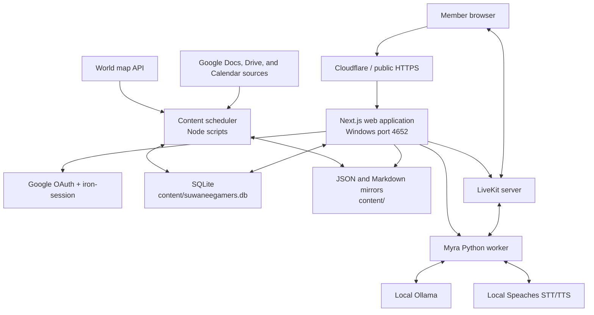
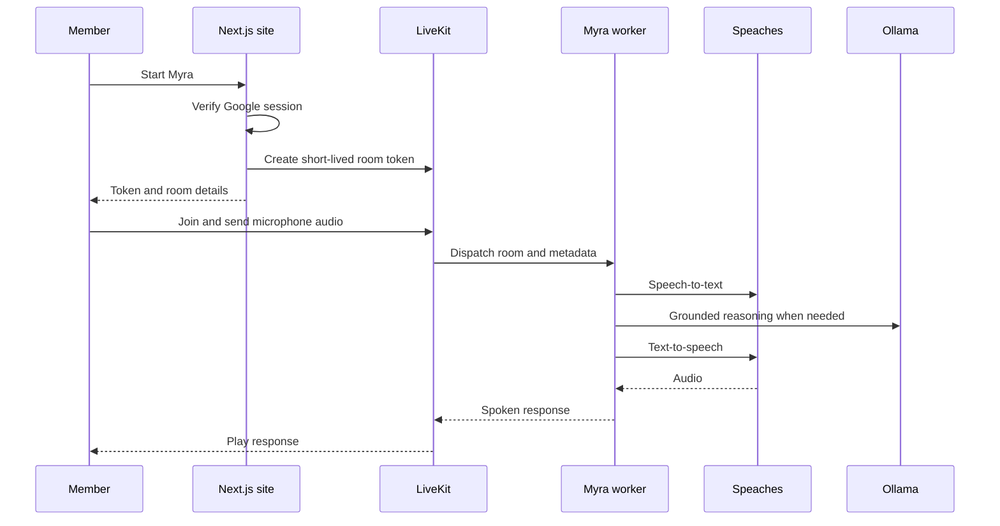

# Suwanee Gamers: Technology Stack and Architecture

Last reviewed: July 29, 2026

## 1. What this system is

Suwanee Gamers is a self-hosted, members-only website for campaigns, calendars,
setting lore, reference material, analytics, a small store, and the Myra voice
assistant.

The main application is a Next.js site backed by a local SQLite database and
JSON content mirrors. Production runs on Windows. Several scheduled scripts pull
or rebuild content, while a separate Python service provides Myra's realtime
voice behavior through LiveKit.

## 2. Technology stack

### Web application

| Area | Technology |
| --- | --- |
| Framework | Next.js 16 App Router |
| Language | TypeScript 5.8 |
| UI runtime | React 19 |
| Styling | Tailwind CSS 4, shared CSS design tokens |
| UI components | Radix UI, Lucide icons |
| Motion and visual effects | Framer Motion, GSAP, Lenis, tsParticles |
| 3D rendering | Three.js, React Three Fiber, Drei, postprocessing |
| Drag-and-drop page editing | dnd-kit |
| Client state | Zustand where local shared state is needed |
| Sessions | `iron-session` encrypted HTTP-only cookies |
| Database | SQLite through `better-sqlite3` |
| Tests | Vitest, Testing Library, jsdom |
| Package manager | pnpm 9 workspace |

### Voice assistant

| Area | Technology |
| --- | --- |
| Realtime rooms and audio | LiveKit |
| Voice worker | Python 3.10+ and LiveKit Agents |
| Language model | Local Ollama |
| Speech recognition and synthesis | Local Speaches server |
| Voice activity detection | LiveKit/Silero integration |
| Python dependency management | `uv` |
| Python tests and linting | pytest and Ruff |

### Operations

| Area | Technology |
| --- | --- |
| Host operating system | Windows |
| Production service manager | NSSM service named `SuwaneeGamers` |
| Development address | `http://localhost:3000` |
| Production application port | `4652` |
| Production build directory | `apps/web/.next-prod` |
| Public edge/proxy | Cloudflare-backed public routes |
| Source control | Git |

## 3. High-level architecture



## 4. Repository layout

```text
suwaneegamers-poc/
|-- apps/
|   `-- web/                       Next.js application
|       |-- app/                   Pages, layouts, and API routes
|       |-- components/            Shared UI and page-block renderers
|       |-- lib/                   Database, content, auth, analytics, and domain logic
|       |-- media/                 Images and session audio served by route handlers
|       |-- brain-vault/           Chronicles source vault and generated wiki
|       |-- brain-tools/           Chronicles ingestion/indexing tools
|       |-- brain-data/            Generated Chronicles indexes and caches
|       `-- scripts/               Web-specific build, start, tests, and maintenance
|-- content/                       JSON/Markdown mirrors and SQLite database
|   |-- page-layouts/              Saved page-block layouts
|   |-- assistant-brain.md         Compact knowledge supplied to Myra
|   `-- suwaneegamers.db           Primary local database
|-- scripts/                       Cross-application sync and maintenance jobs
|-- services/
|   `-- livekit-schedule-agent/    Python Myra voice worker
|-- docs/                          Human-readable project documentation
`-- logs/                          Local operational logs
```

## 5. Web request and rendering flow

1. A browser requests a page.
2. `apps/web/proxy.ts` applies the authentication boundary before protected
   page content is rendered.
3. Public authentication routes remain reachable, while the rest of the public
   site requires a valid Google user session.
4. Admin routes have a separate admin session and password gate.
5. The App Router selects a route under `apps/web/app/`.
6. The route reads structured data through modules under `apps/web/lib/`.
7. The server renders React components and returns the page.
8. Client-side analytics records navigation and interaction events after the
   page loads.

The proxy is important. Protecting only a React layout is not sufficient,
because Next.js can render layouts and pages in parallel. The proxy stops an
unauthenticated request before protected page data is returned.

## 6. Authentication and authorization

### Member access

- Google OAuth begins at `/api/auth/google/login`.
- Google returns to `/api/auth/google/callback`.
- A successful callback creates the encrypted `sg-user` session cookie.
- The session records the Google subject ID, email, name, and optional picture.
- Public site pages require this Google user session.
- `/api/auth/logout` clears both the Google user session and any lingering
  admin session, then redirects to `/signin`.

The sign-in screen requires agreement to the Terms of Service before the Google
button is enabled. Acceptance is remembered by a versioned browser storage key,
so the same browser does not ask on every login. A future material Terms update
can use a new version key and request consent again.

### Admin access

- Admin pages use a separate `sg-admin` session.
- `/admin/login` accepts the admin password.
- Admin APIs and pages verify that session independently.
- An admin session alone does not grant access to ordinary member pages; a
  Google user session is still required.

### Secrets

Secrets belong in environment variables and local environment files. They
should never be copied into documentation or committed to Git. Important
categories include Google OAuth credentials, the admin/session secret,
LiveKit credentials, scheduler tokens, and external-service configuration.

## 7. Content architecture

The content model is intentionally hybrid:

- SQLite is the first source checked at runtime.
- JSON and Markdown files remain readable mirrors, source inputs, and recovery
  fallbacks.
- Some generated systems, such as the Myra assistant brain and Chronicles
  vault, intentionally read filesystem artifacts directly.

### DB-first reads

`apps/web/lib/contentFiles.ts` implements the standard content flow:

```text
readContent("some-file.json")
        |
        v
content_documents row exists? -- yes --> return row.json
        |
        no
        v
read content/some-file.json
```

`writeContent()` writes both the `content_documents` row and the JSON file.
Manual edits to only a JSON file can therefore appear stale if a DB row already
exists.

### Page layouts

Editable and composed pages use ordered block data under:

```text
content/page-layouts/<route>.json
```

The block renderer lives in:

```text
apps/web/components/blocks/BlockRenderer.tsx
```

Custom routes also require an active page record. Route resolution is handled
by `apps/web/lib/customPages.ts` and the catch-all App Router page.

### Main database domains

The SQLite schema is initialized and migrated by `apps/web/lib/db.ts`. Its main
table groups are:

- Site content: `content_documents`, `custom_pages`, `bestiary`, `gazetteer`,
  `organizations`, `territories`
- Campaign data: `campaigns`, `campaign_dms`, `dungeon_masters`, `players`,
  `session_summaries` and its FTS index
- Scheduling: `content_sync_jobs`, `content_sync_runs`,
  `manual_refresh_jobs`
- Identity: `user_profiles`
- Usage data: `analytics_sessions`, `analytics_events`, `security_events`
- Voice data: `voice_sessions`, `voice_questions`, `voice_metrics`
- Claude Platform usage: Anthropic Admin Usage API, filtered by `MYRA_ANTHROPIC_API_KEY_ID`; local voice metrics remain the fallback and source of request/session latency.
- Store data: `store_products`, variants, settings, orders, order items, and
  webhook events

SQLite runs in WAL mode with foreign-key enforcement enabled. The Next.js
development process reuses one connection across hot reloads to avoid
checkpoint conflicts.

## 8. Content synchronization and scheduled jobs

Production starts the content scheduler alongside Next.js unless
`SUWANEE_CONTENT_SCHEDULER=0`.

The scheduler is defined primarily in:

- `scripts/content-scheduler.mjs`
- `apps/web/lib/contentScheduler.ts`

Jobs run sequentially and record their status in SQLite. Current job families
include:

- Lore, history, territories, organizations, Pantheon, Gazetteer, and DM
  reference synchronization
- Campaign headers, roster, session audio, session notes, and generated session
  cards
- Chronicles Google Doc ingestion and index rebuilding
- Automatic campaign journeys using session summaries and the map API
- Myra assistant-brain generation, learning, and safe auto-tuning
- JSON-to-`content_documents` synchronization

After a successful job, affected Next.js paths can be revalidated through the
internal scheduler endpoint.

## 9. Analytics architecture

The browser tracker is:

```text
apps/web/components/analytics/AnalyticsTracker.tsx
```

Events are sent to:

```text
/api/analytics/events
```

Processing and dashboard queries live in:

```text
apps/web/lib/analytics.ts
apps/web/app/admin/analytics/page.tsx
```

The system stores durable sessions and event history in SQLite. It tracks page
views, engagement, media activity, searches, clicks, client errors, paths, and
visitor identity when Google sign-in is available. The Usage dashboard combines
current presence with historical visitor and content-engagement views.

Voice usage is intentionally separate at `/admin/voice-assistant`.

## 10. Myra voice architecture

Myra is a distributed feature with four required runtime pieces:

1. The website microphone/client control
2. `/api/livekit/token`, which authenticates the user and issues a short-lived
   LiveKit room token
3. A LiveKit server for rooms, audio, dispatch, and TURN connectivity
4. The Python `myra` worker for speech and reasoning

### Voice request flow



The token endpoint supplies the worker with:

- A current public calendar snapshot
- America/New_York timezone context
- A voice-session identifier
- `content/assistant-brain.md`
- Current assistant tuning and persona settings

Schedule questions are answered from the dispatched calendar snapshot.
Non-schedule questions are grounded on the compact assistant brain. The worker
uses local Speaches for hearing and voice, and local Ollama for language-model
reasoning.

Default local service addresses are:

- LiveKit: `ws://127.0.0.1:7880`
- Speaches: `http://127.0.0.1:8000`
- Ollama: `http://127.0.0.1:11434`

## 11. Chronicles architecture

Chronicles is embedded in the main Next.js application:

- Public interface: `/chronicles`
- Admin/DM interface: `/admin/chronicles`
- Query engine: `apps/web/lib/brain/`
- Source vault: `apps/web/brain-vault/`
- Maintenance tools: `apps/web/brain-tools/`
- Generated index/cache: `apps/web/brain-data/`

The `chronicles-sources` scheduler job pulls configured Google Docs, processes
stale raw sources, and rebuilds the search index when required. Public/player
answers must remain separate from DM-only material.

## 12. Store architecture

The store is part of the same Next.js application:

- Public routes: `/store`, `/store/[slug]`, `/store/cart`
- Admin route: `/admin/store`
- Domain logic: `apps/web/lib/store.ts`
- UI components: `apps/web/components/store/`
- Persistence: SQLite store tables

The storefront can be enabled or disabled through `store_settings`. Product,
variant, inventory, order, fulfillment, and webhook records are stored locally.

## 13. Development, build, and production

### Development

```powershell
pnpm dev
```

This starts Next.js on `http://localhost:3000` and uses the normal
`apps/web/.next` directory.

### Verification

```powershell
pnpm typecheck
pnpm test
pnpm lint
```

Smaller changes should also run the most relevant targeted Vitest file.

### Production build

```powershell
pnpm --filter web build:prod
```

`apps/web/scripts/build-prod.js`:

- Clears the production image optimization cache
- Sets the repository content directory
- Builds Next.js with webpack
- Writes the result to the inactive immutable `.next-prod-a` or `.next-prod-b` slot

A plain `pnpm build` updates `.next`, not `.next-prod`, and therefore does not
update the production service.

### Production service

The Windows NSSM service is named `SuwaneeGamers`. It runs:

```text
node apps/web/scripts/start-prod.js -p 4652
```

`start-prod.js` launches the content scheduler and Next.js as child processes.
The active slot comes from `apps/web/.next-prod-active.json`. Use
`scripts/restart-and-verify.ps1` or `scripts/deploy-prod.ps1` to switch to a
completed slot and restart the service; never rename a compiled Next directory.

The restart requires an elevated PowerShell:

```powershell
C:\EaselLocal\nssm.exe restart SuwaneeGamers
```

## 14. Important architectural rules

1. Trace the actual route, renderer, and data source before editing.
2. Treat DB-backed content as DB-first; update both SQLite and its file mirror.
3. Keep development `.next` and production `.next-prod` separate.
4. A successful production build is not a deployment until the Windows service
   loads that build.
5. Require Google identity for member pages, even if an admin session exists.
6. Keep public/player-safe Chronicles content separate from DM content.
7. Answer Myra schedule questions from the current calendar snapshot.
8. Apply pronunciation changes only at final TTS input; keep visible spelling
   correct.
9. Preserve generated assets and source provenance when syncing from Drive.
10. Never place credentials or tokens in committed files or documentation.

## 15. Where to start when troubleshooting

| Symptom | First places to inspect |
| --- | --- |
| Page shows stale text | `content_documents`, matching JSON file, route renderer |
| Production shows old UI | `.next-prod` build time/ID, NSSM process start time |
| Login bypass | `apps/web/proxy.ts`, `sg-user`, logout route |
| Missing custom page | `custom_pages`, `pages.json`, matching page layout |
| Missing calendar/session data | calendar feed, `session_summaries`, sync job runs |
| Missing or stale image | rendered URL, public asset bytes, optimization/CDN cache |
| Myra cannot hear | LiveKit room, worker, Speaches STT |
| Myra cannot think | Ollama health/model, worker metadata |
| Myra cannot speak | Speaches TTS and configured voice |
| Scheduled content is stale | `content_sync_jobs`, `content_sync_runs`, scheduler logs |
| Analytics mismatch | `analytics_sessions`, `analytics_events`, dashboard query |
